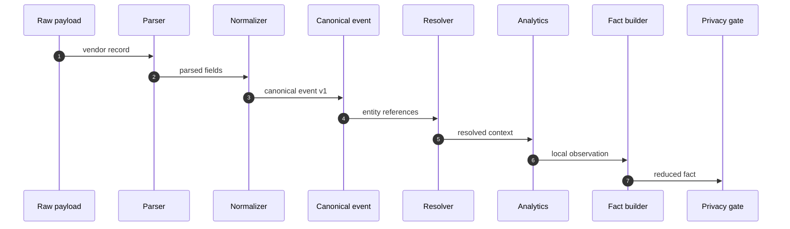

# Overlook - Canonical Event Schema

**Version:** 0.1
**Date:** 2026-08-18
**Parent:** `13-contracts.md`, `14-ingestion-and-sources.md`, `collectors/00-anatomy.md`
**Status:** Architecture. No implementation.

---

> **⚠ ALIGNED TO THE ENGINEERING HANDOFF.**
> `Overlook_Edge_Collector_Engineering_Handoff_v1.1` is the implementation
> boundary and takes precedence over this document. Content here that
> extends the handoff is a **PROPOSED EXTENSION** requiring review under
> handoff §25.3 / §35.1. Open escalations: `01-system-design.md` §41.
> Hard ceiling: **12 vCPU / 64 GB / 1 TB per collector - scale out, not up.**

---

## 1. Why this schema exists

The collector needs one event shape that sits between vendor parsing and Security Fact generation.

That shape must be:

- vendor-neutral
- source-stamped
- time-normalized
- evidence-aware
- privacy-safe
- fit for local reasoning

It is not the same as the Security Fact schema.

- A canonical event is the structured result of parsing and normalization.
- A Security Fact is the reduced, durable assertion that may be sent to SaaS.

The canonical event stays on the collector side unless a local policy says otherwise.

---

## 2. Pipeline position



The canonical event is the point where vendor syntax stops mattering.

---

## 3. Design goals

### 3.1 Keep source provenance

Every canonical event must preserve enough provenance to answer:

- which source emitted this
- which collector handled it
- which parser version produced it
- when it arrived
- what raw evidence backs it

### 3.2 Normalize without over-claiming

The schema must avoid inventing semantics that the source did not prove.

If the source says:

- a user authenticated

do not rewrite that as:

- a user was compromised

unless a detector or resolver has explicit evidence for that claim.

### 3.3 Support multiple source classes

The schema has to work for:

- pull enumerations
- push events
- stream aggregates
- agent reports
- AI gateway records

### 3.4 Make reduction possible

The schema should carry the minimum information needed to:

- deduplicate
- correlate
- score confidence
- decide whether the event becomes a fact

---

## 4. Canonical event shape

The exact wire format can vary, but the semantic fields should not.

```jsonc
{
  "schema_version": "canonical_event.v1",
  "event_id": "evt_01JX9F4Q8N2K8C5Z1M7Q",
  "collector_id": "col-edge-01",
  "tenant_id": "tenant-001",

  "source": {
    "vendor": "fortinet",
    "product": "fortigate",
    "source_id": "fortigate-prod-01",
    "source_type": "firewall",
    "transport": "stream"
  },

  "parser": {
    "name": "fortigate.syslog",
    "version": "1.2.0",
    "confidence": 0.94
  },

  "timestamps": {
    "event_time": "2026-08-18T03:22:11Z",
    "received_at": "2026-08-18T03:22:12Z",
    "normalized_time": "2026-08-18T03:22:11Z"
  },

  "actor": {
    "type": "identity",
    "canonical_id": "idn_...",
    "display": "priya.s",
    "aliases": ["priya.s", "CORP\\priyas"]
  },

  "target": {
    "type": "asset",
    "canonical_id": "ast_...",
    "display": "fw-01"
  },

  "action": "allow",
  "outcome": "success",
  "direction": "inbound",

  "context": {
    "protocol": "tcp",
    "src_ip": "10.1.2.3",
    "dst_ip": "172.16.4.10",
    "dst_port": 443,
    "rule_id": "POL-114",
    "zone": "dmz"
  },

  "severity": "info",
  "confidence": 0.83,

  "evidence": {
    "ref": "sha256:9a5b...",
    "kind": "syslog_line",
    "retained_locally": true
  },

  "privacy": {
    "contains_sensitive_values": true,
    "tokenized": false,
    "exportable": false
  },

  "labels": {
    "source_class": "stream",
    "collector_stage": "normalized"
  }
}
```

---

## 5. Required fields

### Identity and lineage

- `schema_version`
- `event_id`
- `collector_id`
- `tenant_id`
- `source.vendor`
- `source.product`
- `source.source_id`
- `source.transport`
- `parser.name`
- `parser.version`

### Time

- `timestamps.event_time`
- `timestamps.received_at`
- `timestamps.normalized_time`

### Semantic minimum

- one actor, target, or equivalent entity reference
- one action
- one outcome or equivalent state
- confidence when the event is derived rather than directly observed

### Evidence and privacy

- evidence reference
- retention hint
- privacy classification

---

## 6. Field semantics

### 6.1 `actor`

The actor is the entity that initiated the action or is attributed as the initiating source.

Examples:

- user
- service account
- host
- firewall
- AI agent

### 6.2 `target`

The target is the primary object acted upon.

Examples:

- host
- file share
- role
- policy
- prompt
- model endpoint

### 6.3 `action`

The action should use a normalized verb from the collector vocabulary.

Examples:

- allow
- deny
- authenticate
- enumerate
- modify
- create
- delete
- assume
- prompt
- tool_call

### 6.4 `outcome`

The outcome is the observed result.

Examples:

- success
- failure
- partial
- unknown

### 6.5 `confidence`

Confidence should reflect how strongly the canonical event is supported after parsing and normalization.

It is not the same as incident confidence.

---

## 7. Event categories

The canonical event can represent several broad categories.

### 7.1 Observation

A direct sighting of a thing or action.

### 7.2 Relationship assertion

An event that supports a graph edge.

### 7.3 Property update

An event that changes the attributes of an entity.

### 7.4 Summary

A single aggregate over repeated observations.

### 7.5 AI interaction

An event describing prompts, tool calls, model access, or RAG activity.

---

## 8. What the schema must not do

- it must not store raw payloads as the primary record
- it must not silently invent missing semantics
- it must not mix vendor-specific names into the canonical core
- it must not require SaaS to interpret vendor formats
- it must not leak cleartext content that the privacy gate should keep local

---

## 9. Example reductions

### 9.1 Firewall stream

Many raw lines collapse into a few canonical events:

- policy allow pattern
- policy deny pattern
- unusual destination pattern
- shadowed rule pattern

### 9.2 LDAP sweep

Many directory objects collapse into entity and relationship facts:

- users
- groups
- memberships
- ACL edges
- trust edges

### 9.3 Cloud IAM enumeration

Many API objects collapse into permission closure facts:

- roles
- policy bindings
- trust relationships
- effective access edges

---

## 10. Example transition to a fact

```text
raw record
  -> parsed record
  -> canonical event
  -> resolved event
  -> local observation
  -> merged fact
  -> privacy gate
  -> SaaS fact
```

The canonical event is the bridge between parsing and graph building.

---

## 11. Compatibility rule

Fields may be added over time, but the meaning of existing fields must not change without a version bump.

The collector should preserve unknown fields, but only after validation against the current schema version.

