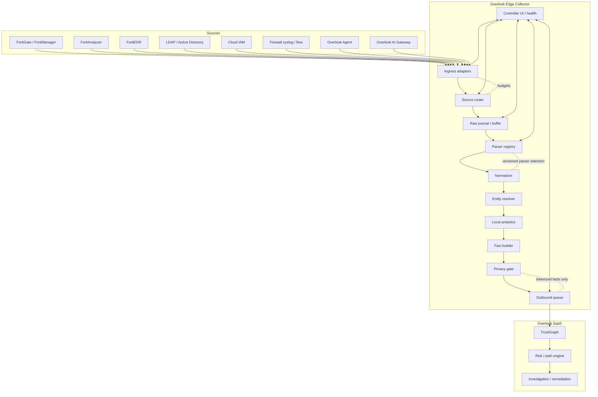
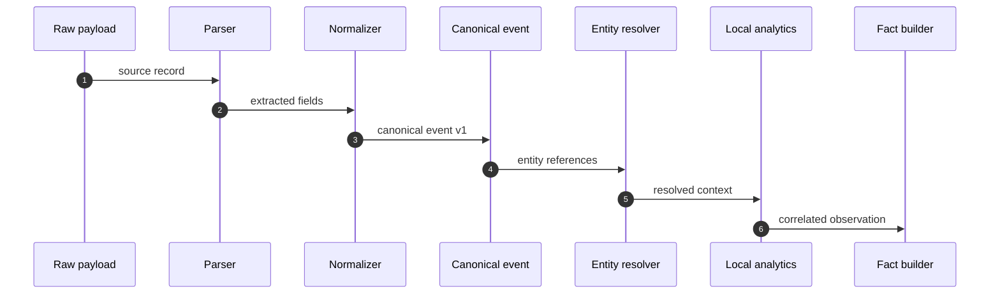
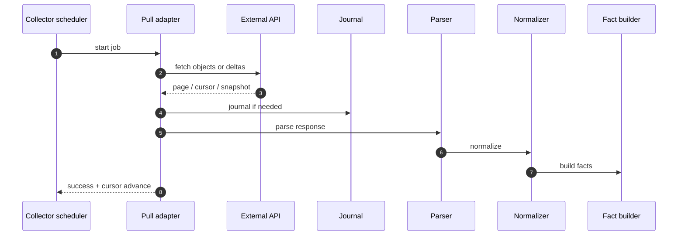
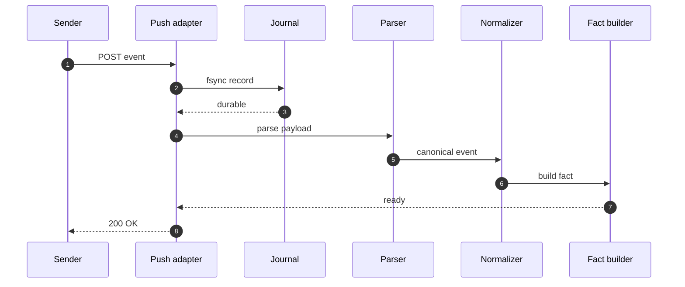
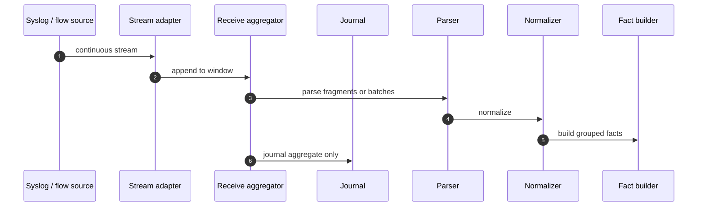
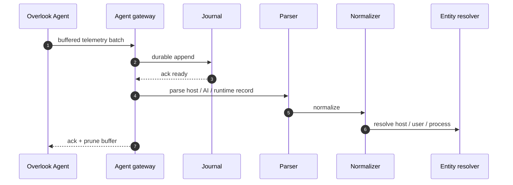
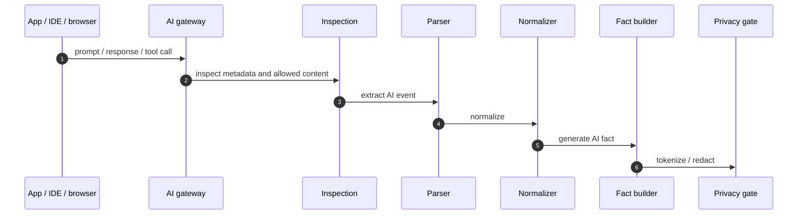

# Overlook - Collector End-to-End Architecture

**Version:** 0.1
**Date:** 2026-08-18
**Purpose:** full end-to-end explanation of how the Overlook collector should work when multiple vendors, source classes, and ingress modes are active at the same time.

**Companion to:** `01-system-design.md`, `03-connectors.md`, `10-appliance-stack-and-engines.md`, `14-ingestion-and-sources.md`, `15-canonical-event-schema.md`, `19-collector-industry-comparison-and-plan.md`, `collectors/00-anatomy.md`, `autoparser/00-index.md`

---

> **⚠ ALIGNED TO THE LOW LEVEL DESIGN.**
> `LLD-edge-collector-v1.0.md` is the implementation boundary and takes
> precedence over this document. It supersedes
> `Overlook_Edge_Collector_Engineering_Handoff_v1.1` for collector internals.
> Content here that extends the LLD is a **PROPOSED EXTENSION**.
> Open escalations: `edge-collector/13-escalations.md`.
> Hard ceiling: **12 vCPU / 64 GB / 1 TB per collector — scale out, not up.**
>
> **RECONCILED WITH THE LLD.**
> This document predates the LLD. Where it describes collector internals —
> process model, stores, stage boundaries — `edge-collector/` is the current
> specification.

---

## 1. What we are building

The Overlook collector is not a log sink and not a generic ETL pipe.

It is a source-local reduction engine that:

- receives many source types at once
- understands each source's recoverability contract
- parses and normalizes vendor records
- resolves entities locally
- builds canonical observations and facts
- keeps raw evidence local
- tokenizes and redacts before egress
- sends only the minimum facts needed for SaaS graph correlation

The collector sits at the privacy boundary.
That is the whole point of the architecture.

---

## 2. Why the collector must be source-aware

Industry products already show that a collector has to be source-aware.

### Stellar Cyber

Stellar Cyber's modular sensor model makes the source-side deployment explicit:

- modular features can be enabled per sensor
- sensor requirements scale with enabled features
- connectors can run on a sensor or a data processor depending on fit
- Interflow is the normalized internal format
- collectors may skip data under high load when capacity is exceeded

That is the right instinct for the appliance layer: resource budgets and placement are part of the collector, not afterthoughts.

### Google SecOps

Google SecOps shows the parser side:

- default parsers normalize raw logs into UDM
- custom parsers and parser extensions let operators map new sources
- data feeds, webhooks, pull sources, and Chronicle API ingestion are distinct paths
- push-based methods require customer buffering and retry
- pull-based methods can be buffered by the service
- entity context and ECG merge data into a contextual graph

That is the right instinct for the transform layer: parsing and normalization are product surfaces.

### Cribl

Cribl shows the control-flow side:

- routes filter and select the correct pipeline
- pipelines execute ordered functions
- routing, cloning, and cascading are first-class

That is the right instinct for the routing layer: decide where data goes before heavy transformation.

### Microsoft Defender for Cloud

Microsoft shows the graph side:

- a cloud security graph aggregates multicloud context
- attack paths are built from real exploitable weaknesses
- remediation steps are attached to the path

That is the right instinct for SaaS correlation: the graph and the fix live downstream.

### Overlook's position

Overlook should combine those patterns without copying their weaknesses:

- source-aware collector
- manifest-driven routing and budgets
- deterministic parser registry
- canonical events and facts
- privacy gate before egress
- SaaS owns graph correlation and remediation context

---

## 3. The full end-to-end picture

This is the core rule:

- many sources can be active simultaneously
- each source keeps its own recoverability and budget
- all sources share the same collector backbone
- vendor syntax disappears before egress

---

## 4. Ingress classes

The Overlook architecture splits ingress by recoverability, not by vendor.

### 4.1 Pull

Pull means the collector fetches from a source API or directory.

Typical examples:

- cloud IAM
- LDAP / AD sweeps
- FortiManager config
- FortiAnalyzer summaries
- API-based EDR reads

Properties:

- recoverable by refetch
- cursor-safe when supported
- lower durability burden than push
- best for configuration and inventory

### 4.2 Push

Push means the source sends records to the collector.

Typical examples:

- webhooks
- event grid style integrations
- export feeds

Properties:

- unrecoverable unless sender retries
- must be journaled before ack
- customer-side buffering is mandatory

### 4.3 Stream

Stream means continuous telemetry.

Typical examples:

- syslog
- NetFlow
- IPFIX
- sFlow

Properties:

- very high volume
- low value per byte
- aggregate on receive
- journal aggregates, not every line

### 4.4 Agent

Agent means Overlook's own software reports in.

Typical examples:

- host/runtime context
- AI gateway telemetry
- endpoint and local context

Properties:

- batched and buffered at the source
- resendable after ack
- should prune only after durable confirmation

---

## 5. The source manifest

The manifest is the operational contract for a source instance.

It answers:

- what the source is
- how it arrives
- how much it may consume
- whether it is recoverable
- which parser families can handle it
- what it produces
- how it should be monitored

### 5.1 Why this matters

Stellar Cyber's sensors and Google SecOps's log types both make an important point:

- a source is not just a string in a config
- it is a bounded operational unit with a contract

Overlook should be stricter because it also has a privacy boundary.

### 5.2 Manifest responsibilities

- define source identity
- define transport class
- define recoverability
- define CPU / memory / disk / queue budgets
- define parser registry keys
- define output fact types
- define freshness and backlog thresholds
- define export policy

### 5.3 Operational consequence

The collector should be able to say:

- this source is healthy
- this source is stale
- this source is quarantined
- this source is over budget
- this source is parse-degraded

That state must be per source, not just per collector.

---

## 6. Source routing

Routing is the first meaningful control point after ingress.

Cribl's pattern is the right mental model here:

- route first
- pipeline second
- ordered functions inside the pipeline

Overlook should adopt the same idea, but keep the stages source-local and privacy-aware.

### 6.1 Routing inputs

The router should look at:

- vendor
- product
- source type
- transport
- fingerprint
- manifest keys
- budget state

### 6.2 Routing outputs

The router should direct the record to one of:

- parser chain
- quarantine
- replay buffer
- metrics-only path
- evidence store

### 6.3 Routing rule

The router must be able to keep unrelated sources isolated.

Example:

- a FortiGate burst should not block AD sweeps
- a parser miss should not block cloud IAM
- AI gateway telemetry should not consume the firewall stream budget

---

## 7. Raw journal and buffering

This is the collector's durability layer.

### 7.1 Why it exists

Google SecOps makes the buffering split explicit:

- pull-based ingestion can be buffered by the service
- push-based ingestion requires customer buffering and retry

Overlook should implement that locally.

### 7.2 What belongs in the journal

- unrecoverable push events
- agent batches before ack
- stream aggregates
- replay samples
- parser failure artifacts

### 7.3 What does not belong

- long-term raw telemetry storage
- a full log lake
- data the collector can refetch cheaply

### 7.4 Journal behavior

- append-only
- segment-based
- replayable
- bounded by retention and disk budget
- recoverable after restart

### 7.5 Stream handling

For streams, the collector should aggregate on receive.

That is the opposite of "write every event to disk."

The rule is:

- high-volume stream -> receive window -> aggregate -> journal aggregate -> emit summary

---

## 8. Parser registry

The parser registry is the operational boundary between raw source syntax and canonical events.

### 8.1 Why it matters

Google SecOps shows the best current pattern:

- default parsers normalize raw logs into UDM
- parser extensions can extend or override extraction
- custom log types exist for tenant-only formats
- parser management is an operational workflow

Overlook should treat parser selection the same way, but tie it to source manifests.

### 8.2 Registry behavior

The registry should answer:

- which parser family applies
- which version is compatible
- what formats are supported
- what the fallback is
- when quarantine is required

### 8.3 Parser responsibilities

A parser should:

- extract fields
- preserve provenance
- emit parse confidence
- stop before inventing unsupported semantics
- hand off to normalization

A parser should not:

- perform graph reasoning
- decide incident severity
- compute attack paths

### 8.4 Parser fallback

If a source does not match:

- quarantine it
- keep a sample
- mark the source degraded
- do not silently drop it

That is how you prevent "the collector is green but the graph is missing half the world."

---

## 9. Normalization

Normalization converts vendor-specific fields into Overlook vocabulary.

### 9.1 What gets normalized

- timestamps
- action verbs
- outcomes
- identities
- targets
- source types
- severities
- protocol / transport metadata

### 9.2 What must survive

- source provenance
- parser version
- collector ID
- evidence reference
- confidence

### 9.3 Why this stage matters

Stellar Cyber's Interflow and Google SecOps's UDM both prove the point:

- once the data is normalized, downstream systems can reason over it
- until then, it is just vendor output

Overlook's canonical event should sit in that exact position.

---

## 10. Canonical event

The canonical event is the bridge between parsing and facts.

It is not SaaS-facing graph data yet.
It is the structured local record that says:

- this source said this
- this parser version interpreted it this way
- these entities are involved
- this confidence applies

### 10.1 Canonical event flow

### 10.2 What a canonical event should include

- event ID
- source identity
- source type
- transport
- parser name and version
- event and receive timestamps
- actor / target or equivalent entities
- action and outcome
- confidence
- evidence reference
- privacy classification

### 10.3 What it should not include

- raw log blob as the primary semantics
- vendor-specific field names in the core shape
- guessed graph semantics
- anything the privacy gate is meant to block

---

## 11. Entity resolution

Entity resolution is where the collector starts turning structured records into actual security context.

### 11.1 Why it belongs here

Google SecOps's Entity Context Graph and Microsoft Defender's cloud security graph both show the same architecture truth:

- events become useful when they can be attached to entities
- entities become useful when they can be linked

### 11.2 What the resolver does

The resolver merges:

- usernames and aliases
- hostnames and IPs
- service principals and app registrations
- roles and trust relationships
- device identities and endpoint telemetry

### 11.3 Resolver inputs

- canonical event
- source inventory
- previous facts
- source confidence
- alias tables

### 11.4 Resolver outputs

- canonical entity ID
- alias set
- ambiguity flags
- confidence adjustment

### 11.5 Resolver rule

The collector should prefer conservative merges over aggressive guesses.

An unresolved entity is acceptable.
A wrong merge is not.

---

## 12. Local analytics

The collector is allowed to reason locally.

It should not wait for SaaS to decide that everything is related.

### 12.1 What local analytics can do

- correlate repeated observations
- calculate rarity
- group events in windows
- detect change bursts
- score local confidence
- infer candidate facts

### 12.2 What local analytics should not do

- compute global attack paths
- aggregate across tenants
- replace SaaS graph correlation

### 12.3 Why local analytics matters

It keeps raw data local while still making the collector useful when SaaS is unreachable.

That is one of Overlook's main differentiators.

---

## 13. Fact builder

The fact builder reduces many observations into durable facts.

### 13.1 Why facts exist

Raw records are too noisy and too large.
The collector needs stable graph-worthy assertions.

### 13.2 Fact types

- entity fact
- relationship fact
- property fact
- finding fact
- summary fact

### 13.3 Fact fields

Facts should preserve:

- first seen
- last seen
- observation count
- source list
- confidence
- evidence reference

### 13.4 Why this matters operationally

This is where Overlook diverges from a SIEM.

A SIEM stores events.
Overlook collapses them into relationships and state.

---

## 14. Privacy gate

This is the boundary that makes the architecture credible.

### 14.1 What it does

- tokenize sensitive identifiers
- strip raw content
- bucket where precision is not needed
- validate schema
- block export of disallowed fields

### 14.2 Why it matters

The whole Overlook claim depends on the collector making the privacy decision locally.

Google SecOps allows managed ingestion, but Overlook's design requires the customer environment to remain the place where cleartext is seen.

### 14.3 Privacy principle

If the field is not needed downstream, it should not leave the collector.

---

## 15. Outbound sync

The collector sends only reduced facts to SaaS.

### 15.1 Outbound behavior

- batch the facts
- sign them
- send over mTLS
- retry safely on transient failure
- preserve ordering where required

### 15.2 SaaS responsibilities

SaaS should:

- verify signatures
- deduplicate
- upsert graph data
- compute attack paths and remediation context

### 15.3 Why this split matters

Microsoft Defender for Cloud shows the graph and attack-path layer can be very powerful.
Overlook should let SaaS do that work, but only after the edge has reduced the data.

---

## 16. Controller UI and health

The collector needs an operational surface.

### 16.1 Health state

Per source, the UI should show:

- registered
- matched
- parsing
- normalized
- resolved
- facted
- queued
- synced
- stale
- degraded
- quarantined

### 16.2 What the UI must answer

- what is connected
- what is failing
- what is stale
- what is over budget
- what was quarantined
- what can be replayed

### 16.3 Why it matters

Stellar Cyber's sensor control and Google SecOps's Health Hub both show that the operator needs visibility into the collection plane.

Overlook should do that locally, without requiring SaaS to be online.

---

## 17. End-to-end sequence by source class

### 17.1 Pull source

Key rule:

- if the source supports a cursor, prefer refetch over hoarding

### 17.2 Push source

Key rule:

- acknowledge only after durability

### 17.3 Stream source

Key rule:

- aggregate on receive, do not journal every raw line

### 17.4 Agent source

Key rule:

- the agent can resend from its own buffer until acked

### 17.5 AI gateway source

Key rule:

- AI telemetry is just another collector source path

---

## 18. Multi-source concurrency

The collector must assume all of these can happen at once:

- FortiGate syslog flood
- AD sweep still running
- cloud IAM pager-backed enumeration
- endpoint batch arriving
- AI gateway event burst

### 18.1 What keeps it safe

- source-specific budgets
- per-source queues
- parser isolation
- backpressure
- separate replay semantics

### 18.2 What must never happen

- one noisy source starving all others
- parser drift in one source taking down the collector
- stream overload causing push records to be dropped
- SaaS outage causing the collector to lose local state

---

## 19. The Overlook-specific design choice

Overlook should not copy the industry's habit of treating ingest and graphing as the same layer.

The split should be:

- Collector: ingest, parse, normalize, resolve, fact-build, privacy gate
- SaaS: correlate, path-find, score, remediate, investigate

That split preserves the privacy model and lets the collector stay operationally simpler.

---

## 20. The recommended build order

If you want a collector that actually works early, build in this order:

1. source manifest
2. source router
3. raw journal
4. parser registry
5. generic parser family
6. canonical event
7. normalization
8. entity resolution hooks
9. fact builder
10. privacy gate
11. outbound sync
12. controller UI
13. source-specific playbooks
14. AI gateway and agent paths

That order is deliberate:

- it keeps the collector useful at each step
- it prevents a giant one-shot implementation
- it makes source onboarding possible before perfect coverage exists

---

## 21. What to borrow and what to reject

### Borrow

- Stellar Cyber: modular feature enablement and explicit deployment placement
- Google SecOps: default parsers, parser extensions, UDM normalization, health monitoring
- Cribl: route-first pipeline control
- Microsoft Defender for Cloud: graph-backed remediation context downstream

### Reject

- a collector that becomes a log lake
- a broker dependency in the customer environment
- an LLM hot path in ingest
- silent parser failure
- unclear source ownership

---

## 22. The single-sentence model

The Overlook collector is a source-aware, privacy-bounded reduction engine that turns concurrent vendor inputs into canonical events and facts locally, then sends only the minimum necessary facts to SaaS for graph correlation and attack-path analysis.

---

## 23. References

### Stellar Cyber

- https://docs.stellarcyber.ai/6.6.xs/Common/Stellar-Architecture.htm
- https://docs.stellarcyber.ai/6.6.xs/Installation/Sensor-Types-Introduction.htm
- https://docs.stellarcyber.ai/6.6.xs/Common/Understanding-Interflow.htm
- https://docs.stellarcyber.ai/6.6.x/Configure/Connectors/Jumpcloud-Connectors.htm

### Google Security Operations

- https://docs.cloud.google.com/chronicle/docs/secops/secops-ingestion
- https://docs.cloud.google.com/chronicle/docs/ingestion/burst-limits
- https://docs.cloud.google.com/chronicle/docs/ingestion/parser-list/supported-default-parsers
- https://docs.cloud.google.com/chronicle/docs/event-processing/using-parser-extensions
- https://docs.cloud.google.com/chronicle/docs/event-processing/parser-extension-examples
- https://docs.cloud.google.com/chronicle/docs/event-processing/entity-graph
- https://docs.cloud.google.com/chronicle/docs/event-processing/data-enrichment

### Cribl

- https://docs.cribl.io/stream/routes/
- https://docs.cribl.io/stream/pipelines/
- https://docs.cribl.io/stream/4.16/working-with-data/

### Microsoft Defender for Cloud

- https://learn.microsoft.com/en-us/azure/defender-for-cloud/concept-attack-path
- https://learn.microsoft.com/en-us/azure/defender-for-cloud/how-to-manage-attack-path
- https://learn.microsoft.com/en-us/azure/defender-for-cloud/defender-for-cloud-introduction
- https://learn.microsoft.com/en-us/azure/defender-for-cloud/attack-path-api

