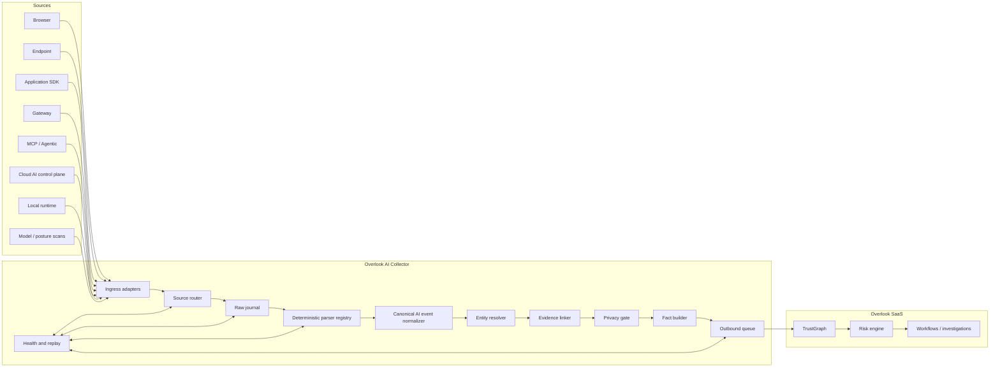
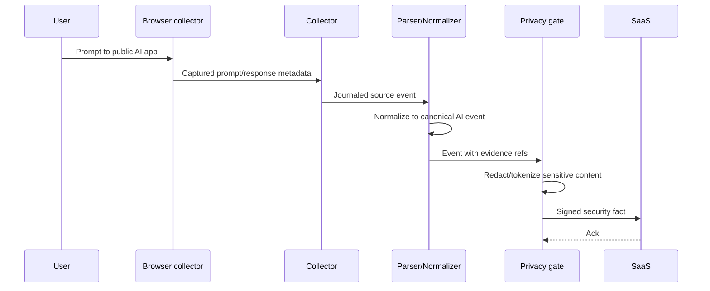
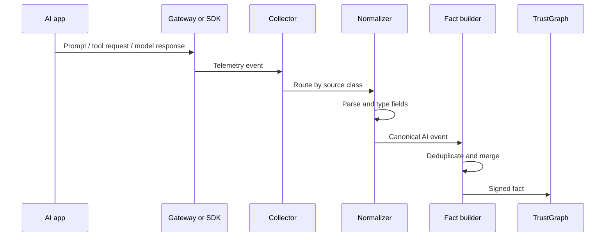
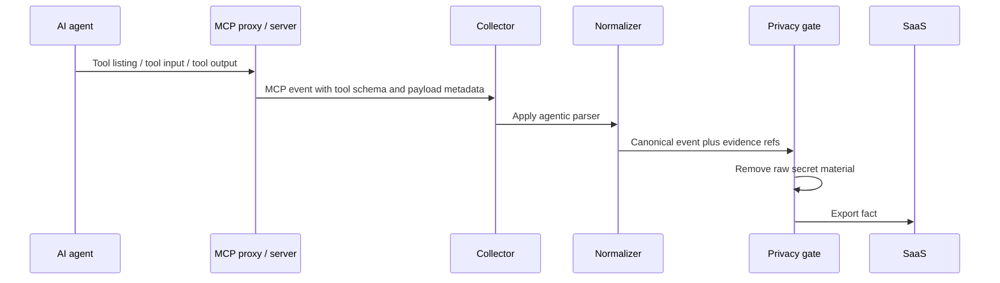
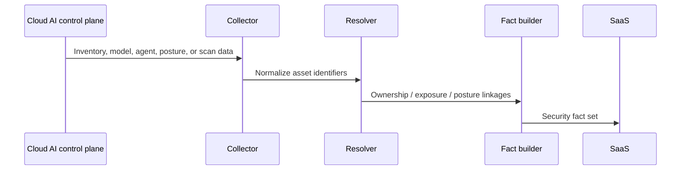

# Overlook - End-to-End AI Collector

**Version:** 0.1
**Date:** 2026-08-18
**Purpose:** show how Overlook should collect, normalize, reduce, and export AI-related telemetry from multiple AI source classes at the same time.

**Companion to:** `../20-collector-end-to-end-architecture.md`, `../15-canonical-event-schema.md`, `../collectors/00-anatomy.md`, `../autoparser/00-index.md`, `01-landscape-and-vendor-comparison.md`

---

## 1. What "AI collector" means in Overlook

An AI collector is not one thing.
It is a set of source classes that all describe some part of the AI workflow:

- workforce usage of public GenAI tools
- application SDK traffic
- API gateway traffic
- agent and MCP tool calls
- cloud AI inventory and posture
- model metadata and security findings
- local runtimes and unmanaged AI assets

The collector must accept all of those concurrently and reduce them into one canonical form.

---

## 2. Source classes

Overlook should treat AI sources as classes, not as one-off vendors.

| Source class | Examples | Why it matters |
|---|---|---|
| Browser | Chrome, Edge, Firefox extensions and browser capture | Employee GenAI usage starts here |
| Endpoint | Desktop sensors, local app inspection, coding assistant telemetry | Captures AI activity outside the browser |
| Application | SDKs, direct API calls, app-side instrumentation | Covers homegrown AI products |
| Gateway | API gateways, AI gateways, proxy layers | Sees traffic before it reaches the model |
| Agentic / MCP | MCP proxy, tool input/output, tool listings | Exposes agent tool use and tool poisoning risks |
| Cloud | Cloud AI control planes and inventories | Shows what was deployed and who owns it |
| Model / posture | Model metadata, scan output, red-team findings | Ties security state to model assets |
| Local runtime | Ollama, LM Studio, vLLM, developer-laptop configs | Covers unmanaged AI that never appears in a registry |

---

## 3. Collector layout

The collector should be split into explicit stages.

The important design rule is that the collector is not a single parser.
It is a routing and reduction system with local durability.

---

## 4. Canonical AI event path

The collector should normalize all AI telemetry into a canonical event form before fact reduction.

### Inputs it should preserve

- source class
- source vendor and version
- actor identity
- workspace, project, app, or agent ownership
- target model or service
- tool name and tool schema for MCP
- prompt and response metadata
- policy decisions or detections
- evidence pointers
- timestamps and causality references

### What it should remove or reduce

- vendor-specific envelope noise
- duplicate prompt copies
- raw secrets
- unnecessary full-text payloads when a structural representation is enough

### What it should never lose

- provenance
- source class
- chain of custody
- enough evidence to explain the fact later

---

## 5. Pipeline stages

| Stage | Input | Output | Failure handling |
|---|---|---|---|
| Ingress adapter | raw request, stream, poll, or webhook | journaled record | retry or backpressure by source class |
| Source router | journaled record | source queue | isolate noisy sources |
| Parser registry | raw source record | parsed structure | deterministic fallback, quarantine on unknown formats |
| Normalizer | parsed structure | canonical AI event | preserve provenance |
| Entity resolver | canonical AI event | linked entities | local resolution only |
| Evidence linker | event + attachments | evidence refs | keep large payloads local |
| Privacy gate | canonical event | redacted or tokenized export candidate | block raw exfiltration |
| Fact builder | export candidate | security fact | merge and dedupe |
| Outbound queue | facts | signed batch | durable retry |
| SaaS ingestion | signed batch | trust graph updates | idempotent ingest |

---

## 6. End-to-end sequences

### 6.1 Workforce GenAI prompt flow

What matters here:

- the raw prompt is not exported by default
- the collector keeps enough evidence to explain the event
- SaaS receives a reduced fact, not the whole conversation

### 6.2 Application SDK and gateway flow

This flow is the most important for homegrown AI applications.

### 6.3 Agentic MCP flow

This is where tool-poisoning, tool misuse, and privilege inflation become visible.

### 6.4 Discovery and posture flow

This flow is how Overlook learns what exists even when there is no runtime telemetry yet.

---

## 7. Failure modes that matter

| Failure mode | Collector behavior |
|---|---|
| Browser extension disabled | mark source stale, keep last-good state |
| Gateway unreachable | backpressure and replay |
| MCP tool schema changes | quarantine parser version until reviewed |
| AI model scan returns partial data | emit partial evidence, do not invent completeness |
| Sensitive prompt text detected | redact before export, preserve local evidence |
| Local runtime discovered with no registry entry | create a new asset candidate and flag unmanaged AI |

---

## 8. What Overlook should export

The collector should export:

- security facts
- evidence references
- source health
- asset inventory summaries
- drift and gap signals

It should not export:

- raw prompt transcripts by default
- raw secrets
- customer-specific parser internals
- full model evaluation payloads unless explicitly requested and allowed

---

## 9. How this fits Overlook's existing architecture

This AI collector is just a specialized instance of the general collector model already defined in:

- `../20-collector-end-to-end-architecture.md`
- `../collectors/00-anatomy.md`
- `../autoparser/00-index.md`

The difference is the source classes and the privacy constraints.
The pipeline shape is the same.

