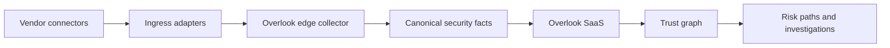
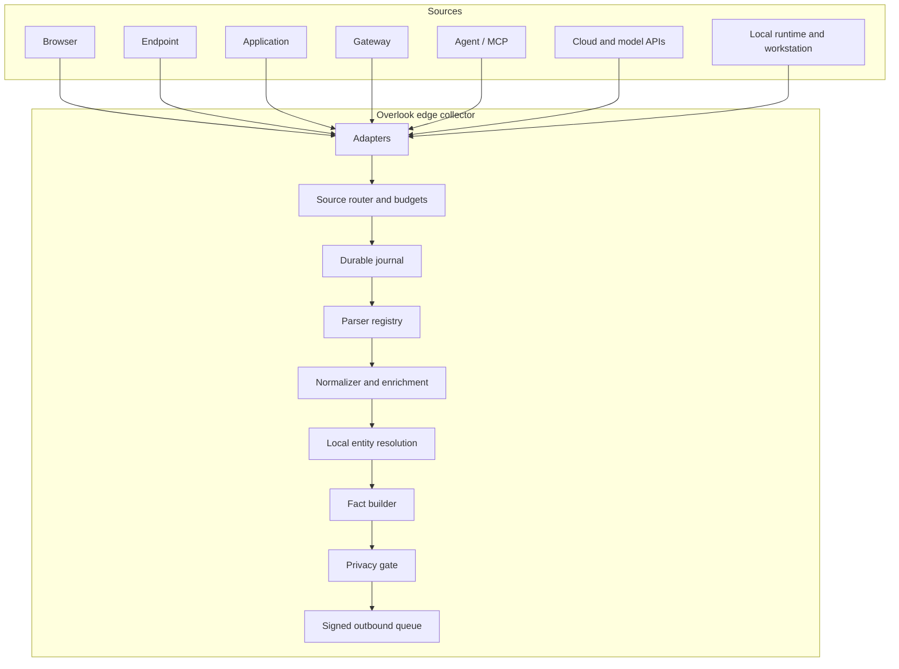
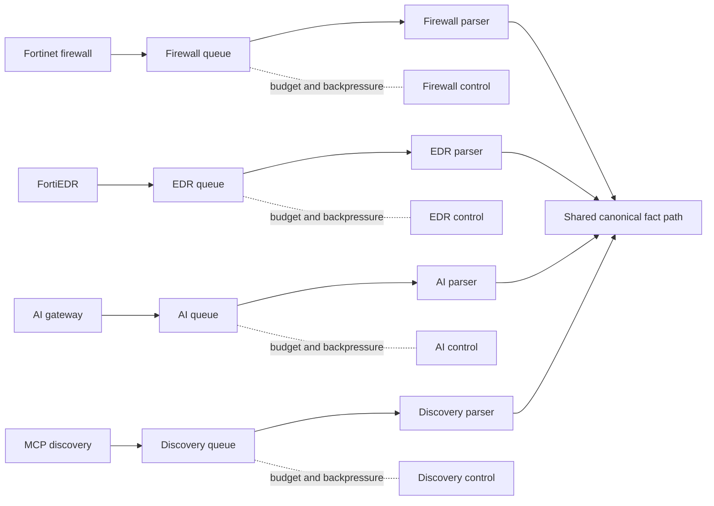
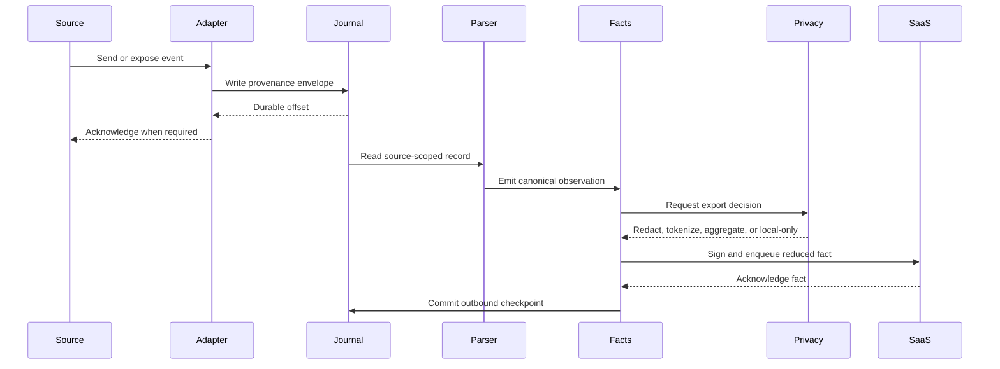
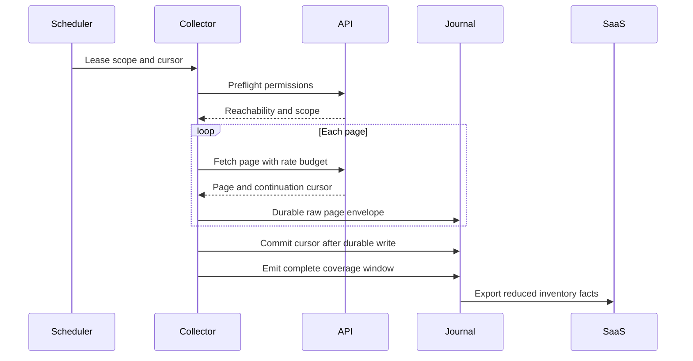
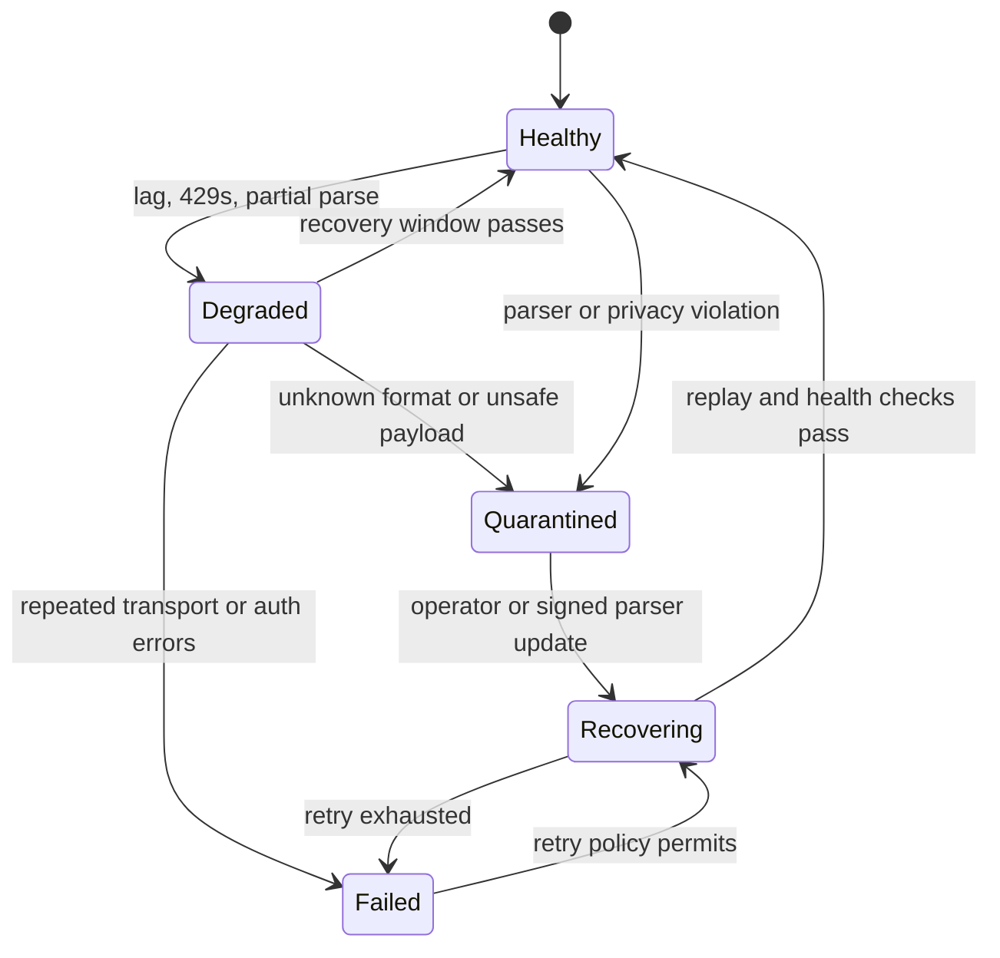
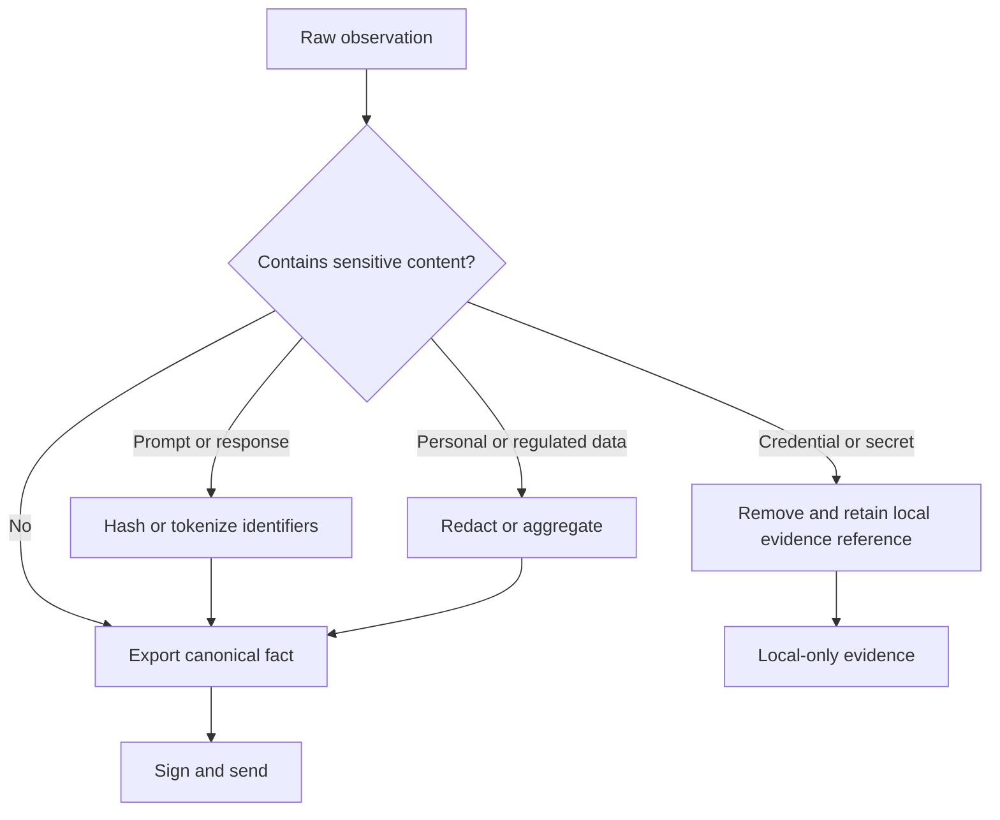
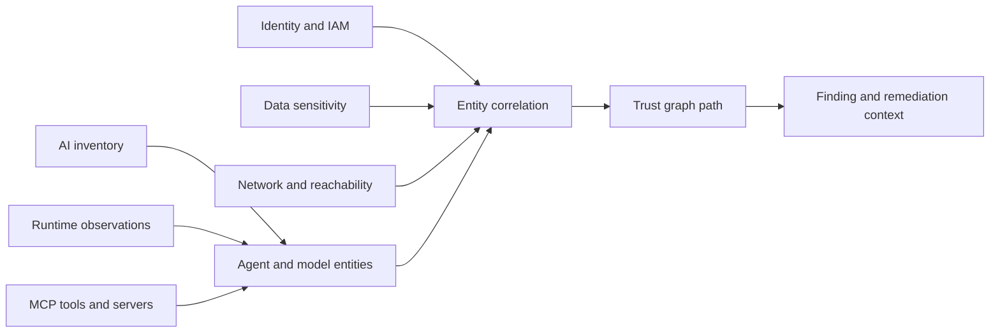

# Overlook AI Security - Mermaid Diagram Pack

> **⚠ ALIGNED TO THE LOW LEVEL DESIGN.**
> `../LLD-edge-collector-v1.0.md` is the implementation boundary and takes
> precedence over this document. It supersedes
> `Overlook_Edge_Collector_Engineering_Handoff_v1.1` for collector internals.
> Content here that extends the LLD is a **PROPOSED EXTENSION**.
> Open escalations: `../edge-collector/13-escalations.md`.
> Hard ceiling: **12 vCPU / 64 GB / 1 TB per collector — scale out, not up.**

---

**Version:** 0.1  
**Date:** 2026-08-18  
**Purpose:** reusable diagrams for architecture reviews, implementation tickets, and operator documentation.

## System context

## Collector layout

## Multi-source concurrency and isolation

## Runtime event sequence

## Pull collector sequence

## Failure and recovery

## Privacy decision path

## Discovery-to-risk path

