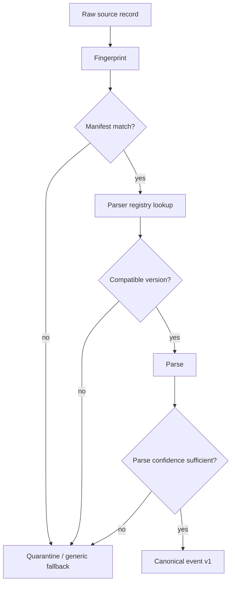

# Overlook - Source Manifest and Parser Registry

**Version:** 0.1
**Date:** 2026-08-18
**Parent:** `00-index.md`, `../14-ingestion-and-sources.md`, `../15-canonical-event-schema.md`
**Status:** Architecture. No implementation.

---

> **⚠ ALIGNED TO THE LOW LEVEL DESIGN.**
> `../LLD-edge-collector-v1.0.md` is the implementation boundary and takes
> precedence over this document. It supersedes
> `Overlook_Edge_Collector_Engineering_Handoff_v1.1` for collector internals.
> Content here that extends the LLD is a **PROPOSED EXTENSION**.
> Open escalations: `../edge-collector/13-escalations.md`.
> Hard ceiling: **12 vCPU / 64 GB / 1 TB per collector — scale out, not up.**

---

## 1. Why these two things belong together

The collector needs two control planes:

1. a **source manifest** that says what a source is allowed to do
2. a **parser registry** that says how source records become canonical events

Without a manifest the collector cannot budget or schedule a source safely.
Without a registry it cannot pick the right parser or know how to quarantine failures.

The two must be versioned together because parser behavior is source behavior.

---

## 2. Source manifest

The source manifest is the authoritative description of one source instance.

It tells the collector:

- what the source is
- how it arrives
- whether it is recoverable
- how much resource it may consume
- which parser families can handle it
- what it produces
- how it should be monitored

### 2.1 Manifest shape

```yaml
source:
  id: fortigate-prod-01
  connector: fortinet
  product: fortigate
  source_type: firewall
  transport: stream           # pull | push | stream | agent
  recoverability: partial     # cursor | sender_retry | none | buffered_agent

  scope:
    tenant_id: tenant-001
    environment: prod
    region: us-east-1

  parser:
    registry_key: fortinet.fortigate.syslog
    preferred_versions: ["1.2.x", "1.1.x"]
    fallback_keys:
      - generic.syslog
      - generic.keyvalue

  budgets:
    cpu_millicores: 500
    memory_mb: 512
    disk_mb_per_day: 250
    queue_depth: 100000

  durability:
    journal_before_ack: true
    replayable: true
    coverage_window: false

  outputs:
    canonical_event: true
    fact_types:
      - relationship
      - property
      - summary

  health:
    freshness_sla_minutes: 15
    parse_success_threshold: 0.95
    backlog_threshold: 50000

  privacy:
    allow_raw_export: false
    evidence_retention_days: 30
```

### 2.2 Manifest rules

- one manifest per source instance
- source identity must be explicit
- transport and recoverability must be explicit
- budgets must be explicit
- parser selection must be explicit
- exportability must be explicit

If a source cannot be described in a manifest, it is too ambiguous to run safely.

---

## 3. Parser registry

The parser registry maps a source signature to one or more parser implementations.

It answers:

- what parser should handle this source
- which versions are compatible
- what formats and transports are supported
- what to do on mismatch
- where quarantine lands

### 3.1 Registry entry shape

```yaml
parsers:
  - key: fortinet.fortigate.syslog
    version: 1.2.0
    source_match:
      vendor: fortinet
      product: fortigate
      transport: stream
      formats: [syslog, keyvalue]
      fingerprints:
        - "date=... time=..."
        - "srcip="
        - "type=traffic"
    produces:
      - canonical_event.v1
    confidence_floor: 0.90
    fallback_to:
      - generic.syslog
    quarantine_on_miss: true

  - key: generic.syslog
    version: 1.0.0
    source_match:
      transport: stream
      formats: [syslog]
    produces:
      - canonical_event.v1
    confidence_floor: 0.70
    fallback_to: []
    quarantine_on_miss: true
```

### 3.2 Registry rules

- parser keys are stable identifiers
- parser versions are semver-like
- matching should be deterministic
- fallbacks should be explicit
- quarantine must be available for unknown or invalid records

---

## 4. Selection flow



The collector should prefer determinism over cleverness.

---

## 5. Parser responsibilities

A parser should:

- recognize a source class or format family
- extract fields without losing provenance
- preserve raw evidence references
- emit parse diagnostics
- report confidence
- stop before inventing unsupported semantics

A parser should not:

- decide global graph semantics
- perform downstream attack-path logic
- redact data by itself unless the source-specific parser owns that policy

---

## 6. Auto-parse levels

The collector can use several levels of parser support.

### L0 format detection

Recognize JSON, syslog, key-value, CSV, XML, or free text.

### L1 structure extraction

Pull fields from structured input.

### L2 template mining

Separate constant and variable fragments for text-like inputs.

### L3 field typing

Identify timestamps, IPs, usernames, hostnames, paths, hashes, and IDs.

### L4 semantic mapping

Map fields into canonical event semantics.

### L5 confirmation and freeze

Lock a parser version after validation so future runs stay deterministic.

The registry exists to manage L4 and L5 without making the collector guess every time.

---

## 7. Error handling

### 7.1 Parser miss

If a source cannot be matched:

- send it to quarantine
- keep a sample locally
- surface a coverage gap
- do not silently drop it

### 7.2 Parser drift

If a source still matches but fields have changed:

- parse what you can
- lower confidence
- preserve unknown fields
- mark the source degraded

### 7.3 Parser failure

If a parser crashes or throws:

- isolate the source
- keep other sources moving
- persist the failure sample
- retry only if the failure is plausibly transient

---

## 8. Registry and manifest together

The normal control path is:

```text
source manifest
  -> source router
  -> parser registry lookup
  -> parser version selection
  -> canonical event
```

The manifest tells the collector what it is allowed to expect.
The registry tells the collector how to interpret it.

---

## 9. Mixed-vendor operation

The collector should allow these to coexist:

- FortiGate syslog
- FortiAnalyzer rollups
- FortiEDR endpoint reports
- AD / LDAP sweeps
- cloud IAM enumerations
- generic firewall syslog

Each source gets its own manifest, but many of them may reuse the same parser family.
That is the point of the registry: one parser implementation, many controlled deployments.

---

## 10. Operational states

Per source, the collector should be able to report:

- registered
- matched
- parsing
- normalized
- quarantined
- degraded
- stale
- healthy

Those states are operationally more useful than a single up/down status.

