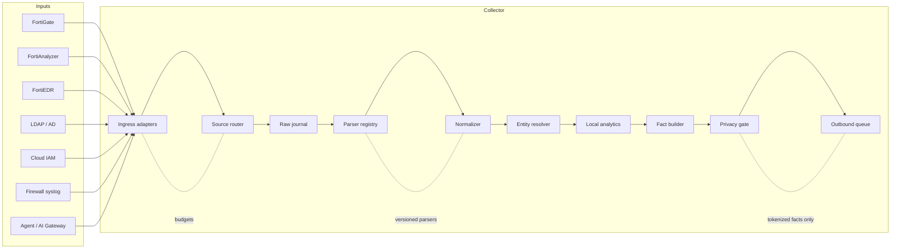
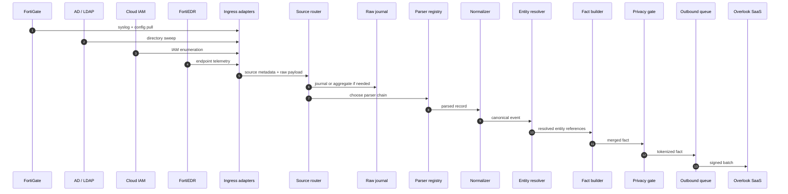

# Collectors - Multi-Source Vendor Playbooks

**Version:** 0.1
**Date:** 2026-08-18
**Parent:** `../03-connectors.md`, `../14-ingestion-and-sources.md`, `../13-contracts.md`
**Status:** Architecture. No implementation.

---

> **⚠ ALIGNED TO THE LOW LEVEL DESIGN.**
> `../LLD-edge-collector-v1.0.md` is the implementation boundary and takes
> precedence over this document. It supersedes
> `Overlook_Edge_Collector_Engineering_Handoff_v1.1` for collector internals.
> Content here that extends the LLD is a **PROPOSED EXTENSION**.
> Open escalations: `../edge-collector/13-escalations.md`.
> Hard ceiling: **12 vCPU / 64 GB / 1 TB per collector — scale out, not up.**

---

## 1. Why this doc exists

The collector does not receive one source at a time in the real world.
It receives a mixed stream:

- firewall syslog and rulebase deltas
- FortiAnalyzer rollups
- FortiEDR endpoint events
- LDAP / AD configuration sweeps
- cloud IAM configuration and audit data
- AI gateway and agent telemetry

The collector has to keep these sources separate at the edges and unified in the middle.
That is the whole design problem.

This document explains how each source family behaves, what the collector should do with it,
and how the shared pipeline handles concurrent multi-source input.

---

## 2. Shared collector pipeline

Every source follows the same backbone:

```text
Source
  -> Ingress adapter
  -> Source router
  -> Raw journal / buffer
  -> Parser registry
  -> Normalizer
  -> Entity resolver
  -> Local analytics
  -> Fact builder
  -> Privacy gate
  -> Outbound queue
  -> SaaS sync
```

The source-specific code should live only in the adapter and parser layers.
The rest of the collector should behave the same way regardless of vendor.

### Mixed-source concurrency



This is the important operational rule:

- many sources can arrive at once
- they must share the collector
- they must not share one undifferentiated parsing path

---

## 3. FortiGate and FortiManager

### 3.1 What they are good for

FortiGate and FortiManager are configuration-rich sources.
They are more valuable for policy and reachability than for raw traffic volume.

The collector should prefer:

- policy tables
- address objects
- services
- NAT
- zones
- VPN definitions
- interface maps
- rule hit metadata when available

### 3.2 Ingress class

Usually a mix of:

- `PULL` for configuration APIs
- `STREAM` for syslog and event logs

### 3.3 What the collector should do

- pull config first, because it produces the highest-value facts
- ingest syslog separately and aggregate it
- keep rulebase and traffic telemetry distinct
- join both only after normalization

### 3.4 Facts produced

- firewall nodes and properties
- policy and object relationships
- observed reachability
- allowed vs denied transitions
- change facts for policy drift

### 3.5 Failure modes

- API pagination drift
- stale device inventory
- syslog bursts
- config / telemetry mismatch

The collector should treat telemetry loss as a coverage issue and config pull failure as a freshness issue.

---

## 4. FortiAnalyzer

### 4.1 Role in the fleet

FortiAnalyzer is not just another log source.
It is often a rollup and aggregation point for Fortinet telemetry.

That means the collector can use it to reduce fan-out when the customer has already centralized logs there.

### 4.2 Ingress class

- usually `PULL`
- occasionally `PUSH` through export or webhook style feeds

### 4.3 What the collector should do

- treat it as a higher-level summary source
- prefer rollup data when it avoids duplicate device ingestion
- preserve the originating device identity if FortiAnalyzer exposes it
- use it for detection context and coverage confirmation

### 4.4 Facts produced

- summarized event counts
- device coverage state
- correlated incident context
- operational freshness

### 4.5 Failure modes

- central log lag
- duplicate device records
- partial export windows

The collector should never assume FortiAnalyzer contains the only truth. It is a reducer, not a universe.

---

## 5. FortiEDR

### 5.1 Role in the fleet

FortiEDR is higher signal than firewall traffic.
It is useful for endpoint and response context.

### 5.2 Ingress class

Usually:

- `PULL` for API reads
- `AGENT`-like semantics if the deployment uses buffered endpoint reports

### 5.3 What the collector should do

- ingest detections, process context, and response state
- keep endpoint events and network events separate until correlation
- preserve response actions as facts, not as raw logs only

### 5.4 Facts produced

- host activity facts
- detection facts
- response state facts
- process and connection context

### 5.5 Failure modes

- device polling gaps
- endpoint batching delay
- dedupe across overlapping event windows

The collector should avoid turning the endpoint feed into a raw event lake. It should collapse to meaningful host facts quickly.

---

## 6. Firewall syslog and flow sources

### 6.1 Role in the fleet

Firewall telemetry is the classic high-volume, low-density source.
It matters because it gives observed reachability and policy effect, not because every packet is a fact.

### 6.2 Ingress class

- `STREAM`
- sometimes `PUSH` if exported through a queue or relay

### 6.3 What the collector should do

- aggregate on receive
- keep per-rule and per-zone counters
- retain only what supports reachability and investigations
- preserve unusual or high-value transitions

### 6.4 Facts produced

- observed reachability facts
- policy effectiveness facts
- denied vs allowed pattern facts
- shadowed rule indicators

### 6.5 Failure modes

- burst overload
- log format drift
- partial truncation
- duplicate line replay after restarts

The collector should never fsync every stream record individually. It should journal aggregates.

---

## 7. LDAP / Active Directory

### 7.1 Role in the fleet

LDAP and AD are one of the highest-value inputs in the collector.
They create the identity and entitlement closure that everything else hangs from.

### 7.2 Ingress class

- `PULL`

### 7.3 What the collector should do

- enumerate users, groups, computers, OUs, GPOs, ACLs, trusts, delegation, SPNs
- preserve scope completeness with coverage windows
- reject partial sweeps as complete
- treat authorization failure differently from empty results

### 7.4 Facts produced

- identity facts
- membership facts
- trust facts
- delegation facts
- ACL and GPO relationship facts

### 7.5 Failure modes

- pagination truncation
- access denied on one subtree
- stale directory snapshots
- silent empty responses

The collector should be strict here. A partial AD sweep is not a success.

---

## 8. Cloud IAM

### 8.1 Role in the fleet

Cloud IAM configuration is one of the most valuable collector inputs.
It is the thing that gives permission closure across cloud domains.

### 8.2 Ingress class

- `PULL`

### 8.3 What the collector should do

- enumerate accounts, roles, policies, permission sets, service principals, trusts, and grants
- use cursor and completion semantics wherever the provider supports them
- treat cloud audit feeds as supplements to config, not replacements

### 8.4 Facts produced

- IAM entities
- trust relationships
- privilege edges
- policy and permission facts
- used vs granted state where supported

### 8.5 Failure modes

- rate limiting
- page token loops
- incomplete account coverage
- stale trust relationships

Cloud IAM should drive coverage windows whenever the provider gives a definitive end-of-enumeration signal.

---

## 9. The end-to-end intake sequence



The important point is not the individual vendor names.
It is that the same collector can accept all of them at the same time and keep the paths separate until they converge into canonical facts.

---

## 10. Practical operating rule

If a source is:

- recoverable by cursor, prefer refetch
- unrecoverable by sender, journal before ack
- high-volume stream, aggregate on receive
- semantically rich configuration, enumerate and emit coverage

That one rule keeps the collector sane.

